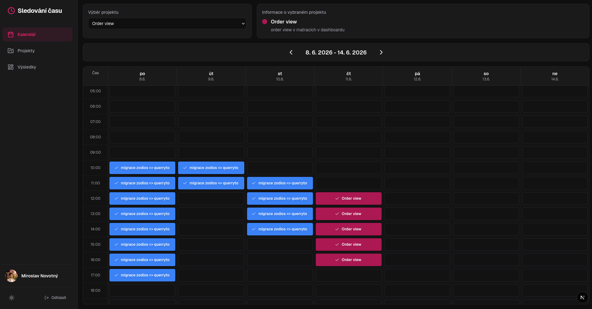
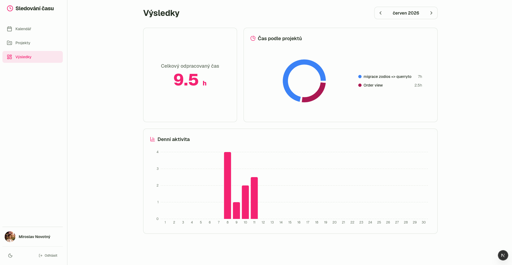

# Sledování času

Jednoduchá webová aplikace pro sledování odpracovaného času na projektech.

## Funkce

* **Kalendář:** Rychlý týdenní přehled pro zapisování odpracovaných hodin k jednotlivým projektům kliknutím do mřížky.
* **Projekty:** Správa a vytváření projektů s možností přiřazení vlastních barev.
* **Výsledky:** Měsíční statistiky a vizualizace odpracovaného času pomocí grafů (PieChart a BarChart).
* **Motivy:** Podpora tmavého a světlého motivu (přepínač v bočním panelu).
* **Autentizace:** Přihlášení přes GitHub (pomocí Better Auth).

## Ukázky z aplikace

### Kalendář (Světlý/Tmavý motiv)


### Výsledky a statistiky


## Spuštění projektu

1. **Instalace závislostí:**
   ```bash
   bun install
   ```

2. **Konfigurace prostředí:**
   Vytvořte soubor `.env` na základě šablony v `.env.example` a doplňte připojení k databázi a GitHub OAuth klíče.

3. **Databáze:**
   Pokud používáte Docker, můžete spustit připravenou databázi:
   ```bash
   ./start-database.sh
   ```
   Následně propusťte schéma do databáze:
   ```bash
   bun run db:push
   ```

4. **Spuštění vývojového serveru:**
   ```bash
   bun dev
   ```

Aplikace poběží na adrese [http://localhost:3000](http://localhost:3000).

## Produkční verze

Nebo využijte produkční verzi na mých webovách stránkých [zde](https://time-tracker.novotnymiroslav.cz/)
